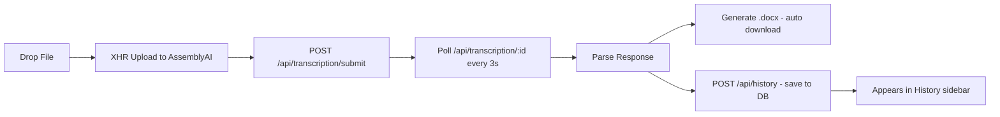

# OHG Scribe

A web application for transcribing audio and video files into polished Word documents. Built with SvelteKit (frontend) and FastAPI (backend), packaged as a single Docker container.

> **Migration note:** This project was previously a Tauri/Rust desktop application. It has been fully converted to a web app using the OHG Launchpad solution template.

## Features

| Feature | Description |
|---------|-------------|
| **Drag & Drop** | Drop audio/video files to transcribe |
| **AI Transcription** | Uses AssemblyAI for high-quality speech-to-text |
| **Speaker Diarization** | Automatically identifies and labels different speakers |
| **Word Export** | Generates professional `.docx` documents |
| **Vocabulary Lists** | Custom and system vocabulary for domain-specific terms |
| **Topic Detection** | Optional AI-powered topic extraction |
| **Sentiment Analysis** | Optional per-utterance sentiment |
| **Transcription History** | Browse and re-export past transcriptions |
| **Meeting Minutes** | AI-powered minutes generation via Anthropic Claude |

---

## Supported Formats

AssemblyAI accepts audio and video files directly (up to 5GB).

| Type | Extensions |
|------|------------|
| **Video** | `.mp4`, `.mov`, `.avi`, `.mkv`, `.webm` |
| **Audio** | `.mp3`, `.wav`, `.m4a`, `.aac`, `.ogg`, `.flac` |

---

## Architecture

```
ohg-scribe/
├── frontend/                     # SvelteKit web app
│   └── src/
│       ├── routes/               # Pages
│       │   ├── +page.svelte      # Main transcription queue
│       │   └── transcript/[id]/  # Transcript viewer
│       └── lib/
│           ├── components/       # UI components
│           ├── services/         # API & business logic
│           │   ├── transcription.ts  # AssemblyAI integration
│           │   ├── docx-export.ts    # Word document generation
│           │   └── history.ts        # Transcript history
│           └── stores/           # Svelte state stores
│
├── backend/                      # FastAPI Python API
│   └── app/
│       ├── api/                  # Route handlers
│       │   ├── transcription.py  # AssemblyAI proxy + polling
│       │   ├── ai.py             # Anthropic minutes generation
│       │   ├── history.py        # Transcript history CRUD
│       │   ├── presets.py        # Transcription preset CRUD
│       │   ├── vocabularies.py   # Vocabulary CRUD + extraction
│       │   └── jobs.py           # Background job tracking
│       ├── services/
│       │   ├── assemblyai.py     # AssemblyAI API client
│       │   └── anthropic.py      # Anthropic API client
│       └── db/                   # SQLAlchemy models + Alembic
│
├── docker-compose.yml            # App + PostgreSQL
├── Dockerfile                    # Multi-stage build (Node → Python)
└── backend/.env                  # Local environment variables
```

---

## Key Technologies

| Layer | Technology |
|-------|------------|
| **Frontend** | SvelteKit 2 + TypeScript |
| **Backend** | FastAPI (Python 3.11) |
| **Database** | PostgreSQL + SQLAlchemy + Alembic |
| **Transcription** | [AssemblyAI API](https://www.assemblyai.com/) |
| **AI Minutes** | Anthropic Claude (via API) |
| **Container** | Docker (single container, multi-stage build) |
| **Word Export** | `docx` npm package (client-side) |

---

## Data Flow


```mermaid
graph LR
    A[Drop File] --> B[XHR Upload to AssemblyAI]
    B --> C[POST /api/transcription/submit]
    C --> D[Poll /api/transcription/:id every 3s]
    D --> E[Parse Response]
    E --> F[Generate .docx - auto download]
    E --> G[POST /api/history - save to DB]
    G --> H[Appears in History sidebar]
```

---

## Local Development

### Prerequisites
- Docker Desktop
- AssemblyAI API key
- Anthropic API key

### Setup

1. **Create `backend/.env`:**
```env
DATABASE_URL=postgresql+psycopg://ohgscribe:ohgscribe@db:5432/ohgscribe
ASSEMBLYAI_API_KEY=your_key_here
ANTHROPIC_API_KEY=your_key_here
DEV_USER_EMAIL=you@example.com
```

2. **Start the stack:**
```bash
docker-compose up --build
```

3. **Open:** http://localhost:8000

The container runs Alembic migrations automatically on startup, then serves the SvelteKit SPA and FastAPI on the same port.

---

## Environment Variables

| Variable | Required | Description |
|----------|----------|-------------|
| `DATABASE_URL` | ✅ | PostgreSQL connection string (use `postgresql+psycopg://`) |
| `ASSEMBLYAI_API_KEY` | ✅ | Server-managed — never sent to clients |
| `ANTHROPIC_API_KEY` | ✅ | Used for minutes generation |
| `DEV_USER_EMAIL` | Dev only | Bypasses Entra ID auth for local dev |
| `STATIC_DIR` | Auto-set | Path to SvelteKit build output |

---

## Authentication

- **Production:** Azure Entra ID via `x-ms-client-principal-name` header (set by Azure Container Apps)
- **Development:** Set `DEV_USER_EMAIL` in `.env` to bypass auth

---

## Database

PostgreSQL with Alembic migrations. Key tables:

| Table | Purpose |
|-------|---------|
| `users` | Auto-provisioned on first login |
| `history_entries` | Transcription results (full JSONB data) |
| `presets` | Saved transcription option sets |
| `vocabulary_categories` | System + user vocabulary groups |
| `vocabularies` | Word boost lists |
| `jobs` | Long-running AI job tracking |

---

## Key Files

| File | Purpose |
|------|---------|
| `frontend/src/routes/+page.svelte` | Main queue UI, file processing orchestration |
| `frontend/src/lib/services/transcription.ts` | AssemblyAI upload + polling with retry logic |
| `frontend/src/lib/services/docx-export.ts` | Client-side Word document generation |
| `backend/app/api/transcription.py` | Transcription submit + poll proxy |
| `backend/app/api/ai.py` | Minutes generation (Anthropic) |
| `backend/alembic/versions/001_initial_schema.py` | Database schema |

---

## IDE Setup

Recommended extensions:
- [Svelte for VS Code](https://marketplace.visualstudio.com/items?itemName=svelte.svelte-vscode)
- [Python](https://marketplace.visualstudio.com/items?itemName=ms-python.python)
- [Docker](https://marketplace.visualstudio.com/items?itemName=ms-azuretools.vscode-docker)
