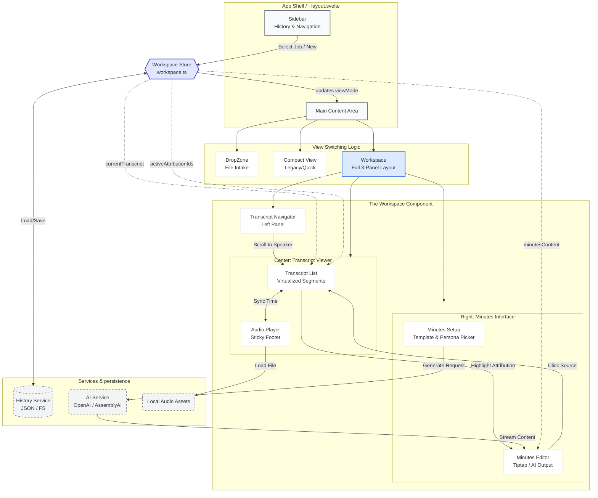

# OHG Scribe

A professional desktop application for transcribing audio and video files into polished Word documents. Built with Tauri 2.0 (Rust backend) and SvelteKit (frontend).

## Features

| Feature | Description |
|---------|-------------|
| **Drag & Drop** | Drop audio/video files to transcribe |
| **AI Transcription** | Uses AssemblyAI for high-quality speech-to-text |
| **Speaker Diarization** | Automatically identifies and labels different speakers |
| **AI Speaker ID** | Uses LeMUR to infer actual speaker names from conversation |
| **Word Export** | Generates professional `.docx` documents |
| **Audio Playback** | Click-to-seek audio player with transcript sync |
| **Vocabulary Lists** | Custom vocabulary for domain-specific terms |
| **Topic Detection** | Optional AI-powered topic extraction |
| **Sentiment Analysis** | Optional per-utterance sentiment |
| **Transcription History** | Browse and re-export past transcriptions |

---

## Supported Formats

**Both audio and video files are supported** — FFmpeg converts everything to optimized MP3 for transcription.

| Type | Extensions |
|------|------------|
| **Video** | `.mp4`, `.mov`, `.avi`, `.mkv`, `.webm` |
| **Audio** | `.mp3`, `.wav`, `.m4a`, `.aac`, `.ogg`, `.flac` |

> **Note:** Audio files work exactly the same as video files. FFmpeg extracts and converts the audio to mono 16kHz 32kbps MP3, optimized for transcription accuracy and small file size.

---

## Architecture

```
ohg-scribe/
├── src/                          # SvelteKit frontend
│   ├── routes/                   # Pages
│   │   ├── +page.svelte          # Main transcription queue
│   │   └── transcript/[id]/      # Transcript viewer with audio player
│   ├── lib/
│   │   ├── components/           # UI components
│   │   ├── services/             # API & business logic
│   │   │   ├── transcription.ts  # AssemblyAI integration
│   │   │   ├── docx-export.ts    # Word document generation
│   │   │   └── history.ts        # Transcript persistence
│   │   ├── stores/               # Svelte state stores
│   │   └── types.ts              # TypeScript interfaces
│
├── src-tauri/                    # Rust backend
│   ├── src/
│   │   ├── lib.rs                # Tauri app entry, command registration
│   │   └── commands/             # Tauri command handlers
│   │       ├── audio.rs          # Audio file storage for playback
│   │       ├── convert.rs        # FFmpeg audio conversion
│   │       ├── history.rs        # History persistence (JSON files)
│   │       ├── lemur.rs          # Speaker identification via LeMUR
│   │       ├── settings.rs       # API key storage
│   │       ├── transcribe.rs     # AssemblyAI API calls
│   │       └── vocabulary.rs     # Vocabulary management
│   ├── binaries/                 # Bundled FFmpeg binaries
│   └── capabilities/             # Tauri security permissions
```

---

## Key Technologies

| Layer | Technology |
|-------|------------|
| **Framework** | [Tauri 2.0](https://v2.tauri.app/) |
| **Frontend** | SvelteKit 2 + TypeScript |
| **Backend** | Rust |
| **Transcription** | [AssemblyAI API](https://www.assemblyai.com/) |
| **AI Speaker ID** | AssemblyAI LeMUR (Claude 3.5 Haiku) |
| **Audio Conversion** | FFmpeg (bundled sidecar) |
| **Word Export** | `docx` npm package |

---

## Data Flow


## Workspace Architecture



---

## Setup

### Prerequisites
- Node.js 18+
- Rust (via rustup)
- AssemblyAI API key

### Install
```bash
npm install
```

### Development
```bash
npm run tauri dev
```

### Build
```bash
npm run tauri build
```

---

## Configuration

### API Keys
Set via Settings modal in-app. Stored securely in:
- `~/Library/Application Support/com.ohg.scribe/settings.json`

### Data Storage
| Data | Location |
|------|----------|
| History | `~/Library/Application Support/com.ohg.scribe/history/` |
| Audio | `~/Library/Application Support/com.ohg.scribe/audio/` |
| Vocabularies | `~/Library/Application Support/com.ohg.scribe/vocabularies.json` |
| Presets | `~/Library/Application Support/com.ohg.scribe/presets.json` |

---

## Key Files

| File | Purpose |
|------|---------|
| `src/routes/+page.svelte` | Main queue UI, file processing orchestration |
| `src/routes/transcript/[id]/+page.svelte` | Transcript viewer with audio player |
| `src/lib/services/transcription.ts` | AssemblyAI API wrapper |
| `src/lib/services/docx-export.ts` | Word document generation |
| `src-tauri/src/commands/convert.rs` | FFmpeg audio extraction |
| `src-tauri/src/commands/lemur.rs` | AI speaker identification |

---

## IDE Setup

Recommended extensions:
- [Svelte for VS Code](https://marketplace.visualstudio.com/items?itemName=svelte.svelte-vscode)
- [Tauri](https://marketplace.visualstudio.com/items?itemName=tauri-apps.tauri-vscode)
- [rust-analyzer](https://marketplace.visualstudio.com/items?itemName=rust-lang.rust-analyzer)

---

## Troubleshooting

### NPM Rollup Error
If you see `Cannot find module @rollup/rollup-darwin-arm64`:
```bash
rm -rf node_modules package-lock.json
npm install
```

### Audio Not Playing
- Ensure transcript was created after v1.3.0 (audio storage feature)
- Check `~/Library/Application Support/com.ohg.scribe/audio/` for MP3 files
